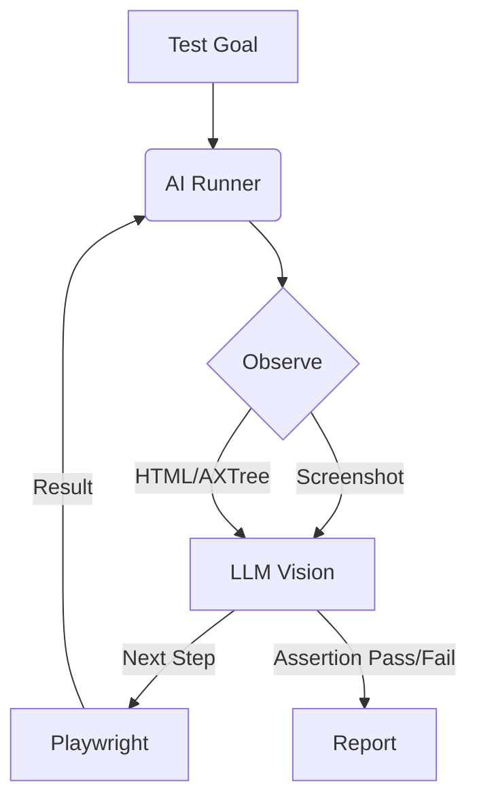

# AI Tester Skill Design

## Mission
To implement "Smart AI Testing" that prioritizes "Vibe" and user intent over rigid DOM assertions.
We are moving from `expect(element).toHaveText("Submit")` to `expect(page).toLookLike("A login form ready for input")`.

## Core Concepts

### 1. Vibe Testing (Visual Assertions)
Traditional testing fails when a pixel moves 1px. AI testing fails only when the *intent* is broken.
- **Goal**: Verify the "vibe" or high-level state of the UI.
- **Mechanism**: Send screenshot to Multimodal LLM (Gemini/GPT-4o).
- **Prompt**: "Does this screenshot show a valid e-commerce checkout page? Return JSON boolean and reason."

### 2. Self-Healing Selectors
Selectors (CSS/XPath) are brittle.
- **Primary**: Try standard stable selectors (test-ids, aria-labels).
- **Fallback**: If not found, Snapshot DOM -> Ask LLM -> "Where is the 'Submit' button now?" -> Generate new selector on the fly -> Execute.

### 3. The Visual Loop
Instead of a static script, the test runs as an agent loop:
1.  **Observe**: Capture Screenshot + Accessibility Tree (AXTree).
2.  **Orient**: LLM analyzes state against the Test Goal.
3.  **Decide**: LLM chooses next Playwright action (click, fill, scroll) or Assertion.
4.  **Act**: Execute Playwright command.

## Architecture

### Directory Structure
```
skills/ai-tester/
├── index.js          # Entry point
├── runner.js         # The main loop (Observe-Orient-Decide-Act)
├── actions.js        # Playwright wrappers (click, type, etc.)
├── eyes.js           # Visual assertion logic (LLM interface)
└── prompts/
    ├── planner.md    # "What should I do next?"
    └── verify.md     # "Does this look right?"
```

### Data Flow


## Tech Stack
- **Engine**: Playwright (Node.js)
- **Vision**: Google Gemini 1.5 Pro / GPT-4o (via OpenClaw Gateway)
- **Context**: Snapshotting accessibility tree for precise grounding.

## Key Features

### `ai.step('Description')`
Natural language steps that auto-translate to actions.
```javascript
await ai.step('Search for "Red Shoes" and pick the first result');
```

### `ai.verify('Assertion')` (The Vibe Check)
Visual verification.
```javascript
await ai.verify('The cart should contain 1 item with price $50');
await ai.verify('The error message should be red and annoying');
```

## Implementation Plan

1.  **Setup**: Initialize Playwright browser.
2.  **Vision Client**: Wrapper for `canvas` or `browser` snapshot tools to get images to LLM.
3.  **Action Mapper**: Map LLM JSON output `{"action": "click", "target": "button[name='buy']"}` to `page.locator(...)`.
4.  **Loop**: Build the recursive run loop.

## Roadmap
- [ ] v0.1: Single step execution (Text -> Action).
- [ ] v0.2: Visual Verification (Screenshot -> Bool).
- [ ] v0.3: Multi-step autonomous flow.

## Prior Art
- `templates/vibe_test.sh`: Basic bash script that opens a URL and takes a screenshot. We will evolve this into the `runner.js`.
